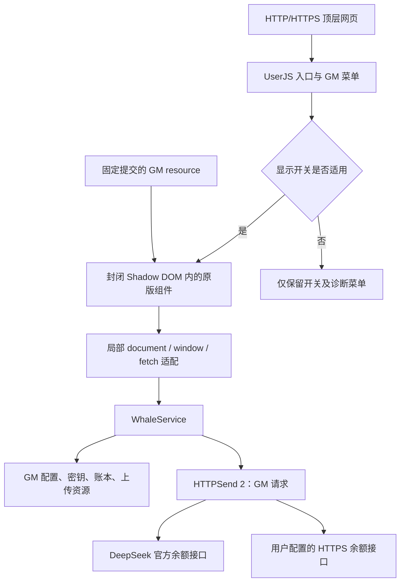

# 右下角组件分析与 UserJS 移植说明

分析对象为本地 `DeepSeek-Balance-Whale-Widget` 仓库的实际源码：包版本 `0.3.0`，提交 `40cebc2937aea674247a0d0e03e16c154f7b9864`。下文行号均针对这个固定版本的 [前端源码副本](../vendor/whale-widget.js)，不是生成文件行号。

## 1. 结论

原组件是一个包含完整编辑器的小型应用：前端约 1.4 万行、665 KB，负责角色、气泡、交互和设置；后端 `lib/index.js` 约 3,200 行，负责 HTTP 路由、凭据、余额、文件存储和会话日志。

UI 可以在普通网页复用，但原版不能直接作为 `@require` 或用户脚本运行：它检查 DSH 的聊天输入框，所有数据来自同源 `/dsh-whale/*`，并依赖服务端会话事件。直接复制到 DeepSeek 聊天页会卡在启动检查或收到接口错误。

本次将前端运行环境和数据来源分开：保留原版交互实现，用浏览器内的服务适配层承接原接口。用户安装一个 `.user.js` 即可使用，无需部署 Node 服务。HTTPSend 继续作为独立 `@require` 请求库。

## 2. 原组件拆解

| 区块 | 原源码位置 | 职责与迁移影响 |
| --- | --- | --- |
| 启动门槛 | 1–45 行 | 检查 `#root` 内聊天输入区域，每 500 ms 检查、最多 5 秒；需移除 |
| CSS 和 DOM | 57–约 1,300 行 | 大量全局样式、菜单和控件；需隔离页面 CSS |
| 多 API 配置 | 约 1,900–2,950 行 | 厂商模板、密钥引用、余额映射、预算/额度；原依赖 DSH 凭据文件 |
| 用量与提醒 | 约 2,950–4,200 行 | 今日/历史记录、阈值、预算、自定义提醒内容 |
| 吸附编辑 | 约 4,200–4,600 行 | 比例和像素边界、翻转线、自由摆放 |
| 气泡编辑器 | 约 4,600–9,600 行 | 序列、模块库、资源选择、排序、字体/颜色等 |
| 气泡运行时 | 约 9,600–11,400 行 | 模块渲染、随机选择、占位符、峰谷倒计时 |
| 余额与动画 | 11,430–11,670 行 | `refresh`、`render`、`animateAmount`、状态和位置 |
| 角色与音频 | 约 12,000–13,450 行 | 上传、裁剪、资源管理、音频片段/组合 |
| 指针与触摸 | 约 13,450–13,890 行 | 像素命中、按压、拖拽、长按、吸附 |
| 初始化与轮询 | 13,890 行以后 | 加载配置、60 秒余额刷新、每秒本机会话事件轮询 |

### 外观和坐标

挂件根节点是固定定位的正方形，默认右下角。基础边长使用视口尺寸和缩放参数计算，最终限制在 122–625 px。原图位于盒子右下方，宽高占约 59.45%，使用透明背景的 `DSniang1.png`。

气泡不是背景图片，而是 `viewBox="0 0 1026 700"` 的 SVG：椭圆主体和小圆尾泡分别动画，深蓝描边为 `#203170`。文字层按气泡坐标换算字号。左侧吸附时根节点 `scaleX(-1)`，文字和图片另作反向补偿，避免显示镜像文字。

不能只把根节点改成 `bottom:0;right:0`：拖拽保存的是锚点方向和偏移，缩放、视口变化以及自定义翻转线都会重新计算位置。

### 透明区域与事件

原版在 Canvas 中读取角色图片的 alpha 通道，按不透明像素判断角色是否被点中。根容器 `pointer-events:none`，透明位置让网页继续收到点击。角色周围并不是一整块遮挡页面的矩形。

桌面拖动和触屏拖动有不同分支；触屏主动接管相关触摸手势，并支持约 1.5 秒长按打开菜单。气泡编辑器内部另有约 0.4 秒长按排序。因此将组件移入 Shadow DOM 时，还必须处理 document 监听和事件目标变化。

### 气泡系统

一个气泡最多 6 行，每行最多 6 个模块；图片模块独占一行，每泡最多一个图片模块。序列包含首次点击、后续点击，以及 A/B 加权分支。随机语句和随机图片按权重选择，并尽量避免连续重复。

模块包括文本、链接、余额、今日已用、峰谷/倒计时、图片、随机语句、随机图片、其它模型余额和额度。样式包括字体、字号、粗斜体、下划线、文字颜色、背景和渐变。编辑器支持预览、模块库、拖拽排版、浮层快捷编辑。

这些功能互相依赖，简单重画一个余额气泡会损失原组件大部分价值。因此保留其运行时和编辑器，通过构建补丁调整环境依赖。

### 数据与轮询

原版默认 60 秒刷新余额；用量面板打开期间另有周期刷新；倒计时使用每秒 ticker。DSH 的 `last-turn.json` 每秒检测会话完成事件，用来弹出单轮成本和播放任务结束音。

原后端除余额差记账外，还能访问 DSH/Codex 本机会话数据、凭据文件以及厂商专用接口。因此原版的模型明细、token 定价、自动订阅额度不能只靠浏览器余额接口恢复。

## 3. 移植结构



### 构建方式

`scripts/build.mjs` 使用 Acorn 定位 `dshwInit`，提取其函数体，去除 DSH 启动门槛及末尾单轮成本轮询。通过 AST 精确改写 13 处图片 `src` 赋值、日期函数和手动额度选择器，再应用带存在性检查的局部补丁，最后用 esbuild 打成单文件 IIFE。

`vendor/whale-widget.js` 保留原样。生成中间文件注明上游提交和标准化换行后的 SHA-256。上游关键位置改变时构建报错，避免静默漏移植。成品不压缩以方便审阅，约 0.67 MB；原图和音频通过 `@resource` 下载，不编码进成品 JS。

### DOM 与事件隔离

宿主节点追加到 `documentElement`，位于页面 React 根节点之外。内部为 closed Shadow DOM，页面选择器不能直接遍历设置和角色节点。所有原版 `document.body.appendChild` 转向内部 mount，选择器和 `getElementById` 也转到 ShadowRoot。

CSS 通过 constructed stylesheet 与 `adoptedStyleSheets` 注入，原来以 `html` 起始的样式选择器改为 `:host`。这样既隔离页面样式，也能在禁止普通内联 style 标签的 CSP 测试页渲染。浏览器测试已验证 `style-src 'none'`；真实页面对脚本和资源的其它策略仍由扩展环境决定。

组件的 document 事件在 ShadowRoot 和外部 document 各监听一次：内部保留真实事件目标，外部只处理事件路径不包含宿主的事件。这样可维持透明像素命中，同时避免同一事件被处理两遍。普通网页按钮不受挂件覆盖影响。

`window.__dsh*` 辅助状态保存在私有 Map。`fetch`、`Audio`、计时器和 `localStorage` 只在生成组件的词法作用域内替换，不覆盖网页自身的这些 API。

### 请求层

余额请求实际调用：

```js
HTTPSend({
  mode: 'GM',
  method: 'GET',
  url: 'https://api.deepseek.com/user/balance',
  headers: { Accept: 'application/json', Authorization: 'Bearer ' + key },
  responseType: 'json',
  timeout: 10000,
  anonymous: true,
}, true)
```

密钥从 GM 存储读取，只放在请求认证头中。内置 DeepSeek 的地址和字段配置锁定，避免误改；自定义模型允许配置 HTTPS URL、认证模板及字段路径。字段解析只读自有属性，拒绝原型链路径。

同页相同模型共享正在执行的 Promise；不同 DeepSeek 标签页通过 GM 缓存和短期租约协调请求。租约写入后再次确认所有权，属于尽力协调，GM 存储没有数据库式原子锁。25 秒缓存减少重复查询；用户手动刷新跳过旧缓存，但仍合并正在执行的请求。

单次请求最多 10 秒，一个刷新流程的实际网络请求预算 22 秒。网络错误、超时或 5xx 最多重试一次；仍失败时可显示同账户最后一次成功值，根节点提示它是缓存。401/403 清除余额缓存并显示认证错误。余额结构缺失或数值为空不会转换成假 0。

## 4. 原接口的适配

`/dsh-whale/*` 在移植版仅是组件内部的路由标识，不会发送到 DeepSeek 网站服务器。

| 原接口/资源 | 移植实现 |
| --- | --- |
| `balance.json` | HTTPSend 查询 DeepSeek，解析币种，更新本地账本 |
| `api-models.json` | GM 模型配置、密钥操作、探测与并发余额查询 |
| `size.json` | GM 大小、音效、气泡、菜单与相关设置；强制关闭每轮成本 |
| `usage-settings.json` | 预警/预算、各模型设置、手动额度 |
| `usage-records.json` | 当前 DeepSeek 账本的今日、7 日、每日/明细记录 |
| `bubble.json` | 气泡序列和模块库，限制大小及基本结构 |
| `roles.json`、`role-pin.json`、`role-delete.json` | 自定义角色上传、置顶、删除 |
| `bubble-imgs.json`、`bubble-img-upload.json` | 图库与图片增删 |
| `audio.json` | 片段增删、按下/松开音效组、置顶 |
| `image.png`、`rua.gif`、声音文件 | GM resource 返回的资源 URL |
| `role-image.png`、`bubble-img.png`、`audio-fragment.wav` | GM resource 或用户上传的 data URL |
| `last-turn.json` | 移除轮询和对应 UI，不伪造对话事件 |

原版大量厂商模板依赖服务端专用逻辑。移植版提供 DeepSeek 与通用 HTTP 两个模板；没有承诺原版全部厂商接口兼容。手动额度保留，但“按会话 token 自动累计”选项已去除。

## 5. 账本语义

同一账户、币种、北京时间同一天，收到按时间顺序排列的两次余额 `B1` 与 `B2` 时：

```text
本次观测消费 = max(0, B1 - B2)
当日消费 = 当日消费 + 本次观测消费
```

消费以 6 位小数累计，最后显示才保留 2 位小数。例如两次各 `0.001` 的扣费会累计为 `0.002`，不会在采样时分别被舍入为 0。

| 情况 | 处理 |
| --- | --- |
| 第一次获得余额 | 建立基准，不计消费 |
| 当天余额下降 | 累加下降额 |
| 余额上涨/充值 | 更新基准，保留当天已统计的消费 |
| 北京时间跨日 | 新一天首次样本只建立基准，不把整段跨日下降算到今天 |
| 更早或相同时间的样本 | 忽略，不回滚账本 |
| 密钥/接口/币种变化 | 旧账本存档，当前账本重新建立基准 |
| 请求过程中改 key/配置 | 丢弃旧请求结果，避免写入新账户账本 |
| 缓存跨过午夜 | 根据当前日期重新读取 todayUsage，不显示昨天的累计值 |

账户标识由密钥版本、接口和字段配置的 SHA-256 构成，不把原始密钥写入账本。重新设置不同密钥会生成新版本；无法仅凭 API key 判断是否还是同一计费账户，因此采取重新建账的保守行为。

**记录是采样区间的净余额下降，不是供应商账单。** 若 60 秒内消费 2 元又充值 10 元，观测结果是上涨 8 元，无法推导其中 2 元消费；关闭脚本期间缺少采样，同日再次读取可能观察到整段下降，跨日则舍弃无法归属的间隔。记录时间是采样时刻，不是实际交易时刻。

### 峰谷时间

官方价格页列出的高峰时段为工作日 UTC 01–04、06–10，其余及周末为空闲，对应北京时间工作日 09–12、14–18。[DeepSeek 价格说明](https://api-docs.deepseek.com/quick_start/pricing/)

前端倒计时与服务层均采用北京时间规则，使用量日期和明细时间也改为北京时间，避免电脑时区与账本日期不一致。这个规则是当前固定逻辑；今后官方调整时需要更新脚本。移植版不硬编码 token 价格估算消费。

## 6. 优化与取舍

1. **展开中的数字可以更新。** 原版模块化气泡在展开后保持整泡快照，余额已请求成功时仍可能显示旧值或“加载中”。移植版注册余额/今日/额度文本节点，刷新和数字动画只改这些节点，不重新抽取随机文案或图片。
2. **保留完整编辑能力。** 用可审阅的构建补丁复用现有前端，避免另写一个功能少很多的挂件。代价是成品仍包含较大的原版编辑器和少量不可达的 DSH 辅助函数。
3. **移除持续无效请求。** 不再等待 DSH 输入框，不再每秒请求单轮事件。页面隐藏时暂停周期回调；显示关闭时不创建组件、加载资源或请求余额，已创建的组件会被卸载。
4. **减少余额请求和误记。** 加入缓存、同页去重、跨页租约、超时/重试和账户变更检查；精确区分缺失字段与 0 元。
5. **独立页面状态。** 配置与账本在同一用户脚本的所有网站间共享，位置与本站显示按主机名保存；原页面 localStorage 不写入挂件数据。
6. **默认低干扰。** 默认关闭声音、预算和低余额提醒；普通网站默认不显示，DeepSeek 默认显示，可通过脚本管理器和挂件中的三个独立开关设置。页面输入区不需要特定类名。
7. **保存原素材来源。** 9 个资源使用固定上游提交的 GM resource，保留 MIT 和原作者署名；不依赖运行时 CDN 浮动版本。

## 7. 验证与边界

`npm.cmd test` 的 16 项测试已通过。重点包含显示开关组合与域名边界、音频 MIME 类型和静音配置、库与主脚本直接拼接执行、充值、小额累加、跨日、换 key/币种、时间倒序、两标签页去重、认证失败与缓存、手动刷新、在途 key 变化、自定义两接口解析及资源删除引用修复。

`npm.cmd run test:browser` 在真实 Edge DOM 中加载已发布 HTTPSend 的固定文件，使用虚构 API key 与余额响应。覆盖无 DSH 页面启动、closed Shadow DOM、严格 style CSP、页面按钮、打开气泡、保存 key、可见余额文本更新、拖拽镜像、390×844 视口、编辑器保存、默认显示范围、本站开关和重新加载。报告和截图输出到 `test-results/`。

余额和编辑器交互测试未使用真实 key，GM API 为模拟。另补充 `tests/extension.mjs`：在新建 Edge 配置中加载真实 Tampermonkey 并安装成品，实际下载依赖、打开 DeepSeek 官网，检查 closed Shadow DOM 内角色图片是否完成加载。没有复制原用户的扩展数据或密钥。移动端验证为窄视口布局，未覆盖所有手机浏览器的音频策略和原生触摸手势。图片/音频上传的数据适配已测试，原版复杂裁剪和每项编辑操作未逐项做端到端回归。

发布前为启动阶段增加保留的诊断菜单和失败提示，覆盖 HTTPSend 缺失、GM/资源初始化、Shadow DOM/样式、组件创建等阶段。诊断只包含版本、阶段、资源数量、图片状态、隐藏状态及错误，不包含凭据。用户脚本尚未发布，当前版本统一为 1.0.0。

### 真实扩展中静默跳过入口

已发布 HTTPSend 的最后一行是没有分号的 `if (typeof module === 'object' && module.exports) module.exports = HTTPSend`。Tampermonkey 将依赖和以 `(() => { ... })()` 开头的主脚本拼接，JavaScript 不会在这个位置自动插入分号，于是挂件的函数表达式成了 `HTTPSend(...)()` 调用的参数，整段归入前面的 `if`。浏览器里条件为假，组件不执行，也没有异常。

修复是在构建产物自执行函数前添加明确的 `;`。此前用两个 script 标签分别加载库与成品，以及在文件开头插入日志的扩展探针，都会人为建立语句边界，掩盖问题。现在单元测试直接拼接已发布库与产物，浏览器测试也用同一个 script 标签执行；真实扩展测试安装未经插桩的成品。

### 透明控件拦截点击

原版主菜单依靠 `opacity:0` 隐藏，移植层又给按钮和表单控件显式设置 `pointer-events:auto`。父菜单的 `pointer-events:none` 无法阻止这些子元素重新参与命中，导致页面按钮被不可见菜单遮挡。原版菜单按钮在未悬停时也只有透明度变化；气泡链接有类似的显式命中设置。

移植层现在按关闭状态对菜单、菜单按钮、气泡及其后代应用 `visibility:hidden` 和 `pointer-events:none`；菜单与气泡同时同步 `inert`，主菜单同步 `aria-hidden`/按钮的 `aria-expanded`。关闭后立即停止命中和聚焦，重新打开恢复，元素尺寸仍可用于吸附和菜单定位。

回归测试在透明控件原坐标下放置网页按钮，使用真实鼠标点击验证事件归属，并覆盖菜单两种关闭方式、重新打开、键盘焦点及气泡链接。该用例在修复前能复现点击被吞的问题。

### 音频资源 MIME 类型与播放状态

在真实 Edge + Tampermonkey Beta 5.5.6237 中，`GM_getResourceURL` 返回的 MP3 为 `data:application;base64,…`。原适配层直接交给 `Audio`，媒体元素停留在 `readyState=0`，错误为 `MEDIA_ELEMENT_ERROR: Unable to load URL due to content type`；原组件吞掉了加载和播放异常，用户只看到角色动画。

新增 `src/audio.js`：在读取已知 MP3/WAV 的 GM 资源时修正 data URL 的 MIME 类型，保留参数及数据；统一记录媒体加载、播放失败和完成状态，供管理器诊断菜单查看。隐藏组件或销毁时停止正在播放的媒体，隐藏期间阻止延迟回调重新播放。

音量配置统一以 0 表示静音，兼容已有 `sound:false`，默认静音；已启用的音量保持原值。原 `playPress` 在按下槽为空时提前返回，没有重置 `releasePlayed`，导致下一次松开不响；现将空槽处理放在状态复位之后，切换音效组也会停止旧音频并清除延迟回调。

`tests/audio.mjs` 使用真实媒体元素及解码器，覆盖两个 MP3 预设、两个 WAV、切换音效组、重复松开、双空槽和音量 0。错误 MIME 的用例在修复前能复现 `NotSupportedError`。`tests/extension.mjs` 不修改用户脚本，通过 CDP 观察真实扩展创建的媒体元素，确认 MIME、加载状态、音量以及按下/松开各自的 `playing` 和 `ended` 事件。无头测试验证浏览器播放流程，未测量扬声器输出。

### 菜单按钮难以点击

原 `onDocPointerMoveCursor` 用角色像素透明度决定菜单按钮是否显示。鼠标从角色移向按钮时经过透明像素，会移除按钮的显示类；隐藏按钮也不再参与 `elementFromPoint` 命中，因此移动到原按钮位置无法重新显示。沿图片上方透明区域逐步移动的鼠标回归可稳定复现。

现在用角色图片与按钮的矩形范围（外扩 6px）决定按钮显示，像素透明度仍决定角色拖拽和点击。此范围只用于判断鼠标位置，没有新增遮罩或可点击元素。保留用户主动隐藏菜单按钮的设置。

浏览器回归检查按钮中心与边缘九点、周边隐藏控件命中扫描、透明图片下方网页按钮、左右镜像及窄视口。真实 Edge + Tampermonkey 测试通过透明区域逐步移动到菜单按钮，再验证一次点击打开、一次点击关闭。

### 全网站支持与显示策略

元数据匹配所有 HTTP/HTTPS 顶层网页。`src/display.js` 读取 `display:global`（默认 false）、`display:site:主机名`（默认 false）、`display:deepseek`（默认 true），按“全网站开启，或本站开启，或当前为 DeepSeek 且 DeepSeek 开启”决定显示。DeepSeek 仅匹配根域名及其子域名，排除 `notdeepseek.com` 等相似域名；旧的 `hidden:主机名` 不再参与策略。

入口先注册显示开关，再按需创建组件，关闭时调用统一销毁逻辑。管理器菜单用勾选符号展示开关状态，挂件菜单提供复选框及当前显示来源。`GM_addValueChangeListener` 监听当前页适用的三个存储键，使多个域名/标签页同步更新；回到可见标签页时也重新读取设置。

真实扩展测试在 DeepSeek 官网修改全网站开关，观察另一普通 HTTP 网站标签页挂载/卸载并验证刷新恢复。关闭全网站后 DeepSeek 仍显示；单独开启 DeepSeek 页的本站开关后，即使关闭 DeepSeek 开关也保持显示，其他主机名不受影响。

用户侧没有 DSH/Codex 文件、真实每轮 token 明细或网页会员额度，所以相应入口已去除或改为明确的手动填写；余额变化不与网页对话建立虚假的一一对应关系。
